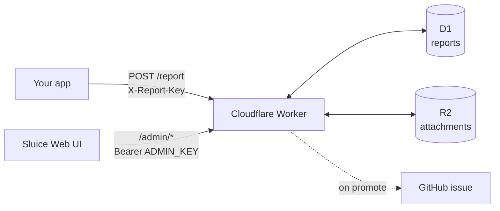
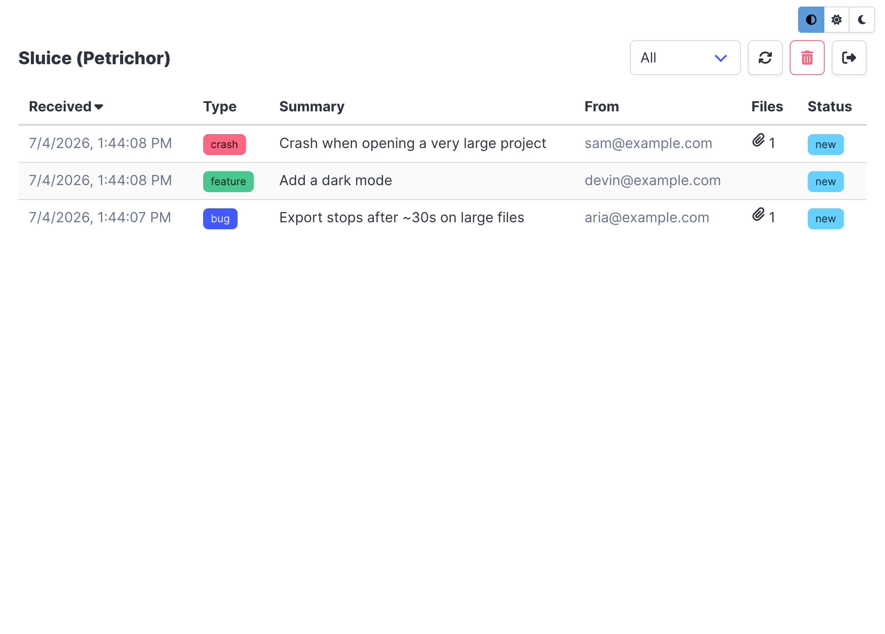
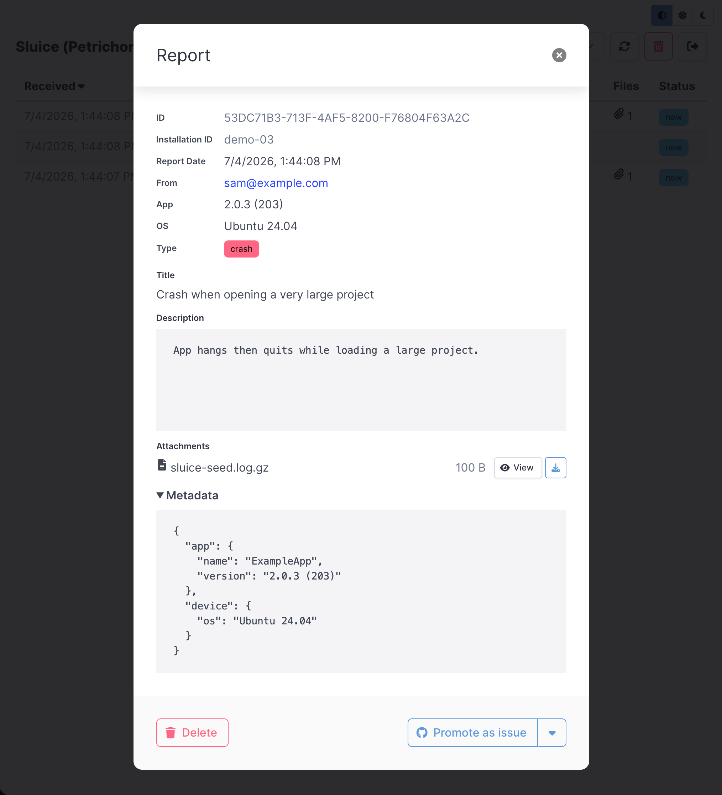
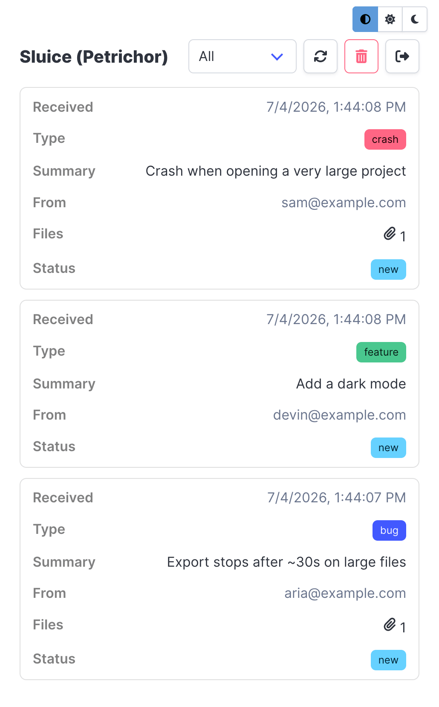

# Sluice

<p align="center">
  
</p>

A self-hosted place to collect problem reports from your app and turn the good
ones into GitHub issues.

Reports are stored, not auto-filed. When your app POSTs a report, the Worker
saves it to D1 (and any attachments to R2) and stops. You review reports in the
web UI and promote the real ones to issues yourself, so your repo never fills up
with spam.



All the data stays in your own Cloudflare account. Any client that can send a
multipart POST can use it (native app, Electron, web, a shell script). Runs on
Cloudflare's free plan.

## Screenshots

| Homepage                                 | Report Detail                                    | Mobile View                                    |
| ---------------------------------------- | ------------------------------------------------ | ---------------------------------------------- |
|  |  |  |

## Layout

The backend Worker (`worker/`) and the Preact web UI (`web/`) share one root
`package.json`.

- `worker/src/` - the Worker as small ES modules (`index.ts` is the router;
  `ingest.ts`, `admin.ts`, `github.ts`, plus helpers). Wrangler bundles them.
- `worker/schema.sql` - the D1 schema (`reports` + `attachments`).
- `worker/wrangler.jsonc.example` - bindings and config template (copy to
  `worker/wrangler.jsonc`, which is gitignored).
- `worker/.env.example` - local secrets template (copy to `worker/.env`).
- `worker/seed.sh`, `worker/testreport.sh` - sample data and a smoke test.
- `web/` - the UI. `web/src/config.example.js` → `web/src/config.js` (gitignored)
  holds the product name and default URL.

Run `wrangler` from inside `worker/`. The npm scripts do that for you.

## Scripts

| Command              | What it does                             |
| -------------------- | ---------------------------------------- |
| `npm run dev`        | UI dev server at `http://127.0.0.1:8123` |
| `npm run dev:api`    | Worker locally (`wrangler dev`)          |
| `npm run deploy:api` | Deploy the Worker                        |
| `npm run deploy:web` | Build and deploy the UI to Pages         |
| `npm run typecheck`  | Typecheck the Worker                     |

## Make it yours

Branding and per-instance config live in three files. The first two are
gitignored (you copy them from `.example` templates during setup), so you can
push the repo publicly without committing your own values:

- `worker/wrangler.jsonc` → `vars`: `PRODUCT_NAME`, `GITHUB_OWNER`, `GITHUB_REPO`,
  the D1 `database_id`, and the size/rate caps.
- `web/src/config.js`: `PRODUCT_NAME` and an optional default Worker URL.
- `web/src/styles.scss`: the accent colour (`$primary`) - committed, one line.

## Setup

You need Node, a Cloudflare account, and a GitHub account.

First copy the config templates. These three files are gitignored so your own
values never get committed - the repo stays a clean template:

```bash
cp worker/wrangler.jsonc.example worker/wrangler.jsonc
cp worker/.env.example worker/.env
cp web/src/config.example.js web/src/config.js
```

Then install and log in:

```bash
npm install
cd worker
npx wrangler login
```

Create the bucket and database:

```bash
npx wrangler r2 bucket create sluice-reports
npx wrangler r2 bucket lifecycle add sluice-reports \
  --prefix reports/ --expire-days 30 --name expire-blobs

npx wrangler d1 create sluice-reports
# paste the returned database_id into wrangler.jsonc, then:
npx wrangler d1 execute sluice-reports --remote --file schema.sql
```

Set the secrets:

```bash
npx wrangler secret put APP_KEY       # your app sends this in X-Report-Key
npx wrangler secret put ADMIN_KEY     # gates the /admin API (keep it safe)
npx wrangler secret put GITHUB_TOKEN  # fine-grained PAT, Issues: read/write on your repo
```

For promotion, `GITHUB_OWNER` and `GITHUB_REPO` in `wrangler.jsonc` point at the
repo issues are filed on. Leave `GITHUB_TOKEN` empty to test everything but
promotion.

## Run it locally

```bash
cd worker
cp .env.example .env    # fill in the keys
npx wrangler d1 execute sluice-reports --local --file schema.sql
cd ..

npm run dev:api         # Worker at http://127.0.0.1:8787
npm run dev             # UI at http://127.0.0.1:8123
```

In the UI, set the Worker base URL to the local or deployed Worker and paste the
admin key. `worker/testreport.sh` runs a full ingest/list/detail/attachment/
delete/prune cycle; `worker/seed.sh` adds a few sample reports.

## Deploy

```bash
npm run deploy:api
npm run deploy:web
```

`deploy:web` passes `--branch production` so the upload always lands on the Pages
project's production branch (and thus your custom domain), instead of inferring
the branch from git - otherwise deploying from a differently-named git branch
creates a _preview_ deployment and the domain doesn't update. If your project's
production branch isn't `production`, change the flag in `package.json`.

To use your own domains, put the zone on Cloudflare, add a custom domain to the
Worker (e.g. `api.example.com`) and to the Pages project (e.g.
`reports.example.com`), and turn on Cloudflare Access in front of the UI so it
needs a login. Leave `/report` public for your app.

## The report format

`POST /report`, `multipart/form-data`, header `X-Report-Key: <APP_KEY>`.

| Field            | Type              | Required | Description                                                                                                                                                                                                                                  |
| ---------------- | ----------------- | -------- | -------------------------------------------------------------------------------------------------------------------------------------------------------------------------------------------------------------------------------------------- |
| `reportId`       | string (UUID)     | yes      | Client-generated UUID. Also the idempotency key - re-sending the same `reportId` is a no-op and returns `duplicate: true`.                                                                                                                   |
| `installationId` | string            | yes      | Anonymous per-install identifier. Subject of the per-installation rate limit and daily cap.                                                                                                                                                  |
| `category`       | string (enum)     | yes      | One of `bug`, `crash`, `feature`, `other`.                                                                                                                                                                                                   |
| `summary`        | string            | yes      | Short title. Max 200 chars.                                                                                                                                                                                                                  |
| `description`    | string            | yes      | The report body. Max 5000 chars.                                                                                                                                                                                                             |
| `email`          | string            | yes      | Reporter's email. Max 254 chars.                                                                                                                                                                                                             |
| `appVersion`     | string            | yes      | Version of the reporting app. Max 100 chars.                                                                                                                                                                                                 |
| `osVersion`      | string            | yes      | OS / platform the app runs on. Max 100 chars.                                                                                                                                                                                                |
| `metadata`       | string (JSON)     | no       | Opaque JSON blob, stored as-is and never parsed. A catch-all for extra or future fields (device info, diagnostics, flags) - add keys without a schema change.                                                                                |
| `attachment`     | file (repeatable) | no       | Zero or more file parts (logs, screenshots, recordings); send one part per file, all named `attachment`. Defaults: up to 10 files, ≤ 10 MB each, ≤ 25 MB total - tunable via `MAX_ATTACHMENTS` / `MAX_ATTACHMENT_BYTES` / `MAX_TOTAL_BYTES`. |

```bash
curl -X POST https://api.example.com/report -H "X-Report-Key: $APP_KEY" \
  -F "reportId=$(uuidgen)" -F "installationId=anon-123" -F "category=bug" \
  -F "summary=Crash on export" -F "description=Steps to reproduce..." \
  -F "email=user@example.com" -F "appVersion=2.1.0" -F "osVersion=macOS 14.5" \
  -F "attachment=@app.log.gz;type=application/gzip" \
  -F "attachment=@shot.png;type=image/png"
```

The admin endpoints under `/admin/*` (list, detail, attachment download, promote,
status, delete, prune) all take `Authorization: Bearer <ADMIN_KEY>`.

## Rotating the admin key

`ADMIN_KEY` is the one credential that matters - it's both your login to the web
UI and the bearer token for the whole `/admin` API. Rotate it if it ever leaks
(or just periodically). From `worker/`:

```bash
openssl rand -base64 32          # generate a strong new value
npx wrangler secret put ADMIN_KEY # paste it when prompted
```

`wrangler secret put` updates the live Worker immediately - no redeploy needed.
The old key stops working at once, so the UI's next request 401s and signs you
out; sign back in with the new key. Do that on every browser/origin you use it
from (e.g. `reports.petrichor.page`, and `127.0.0.1:8123` if you develop
locally). If you use `testreport.sh` / `seed.sh`, update `ADMIN_KEY` in
`worker/.env` too.

The same steps rotate `APP_KEY`, except that key is also embedded in your app, so
you'd ship an app update carrying the new value.

## Notes

- The app key isn't a real secret if your app is open source; it just raises the
  bar. The admin key is the one that matters. Rate limits, size caps, and daily
  caps keep abuse cheap to absorb, and there's no billing on the free plan.
- Promoted issues leave out the reporter's email and the raw metadata blob.
- To file issues somewhere other than GitHub, edit `worker/src/github.ts` and the
  `GITHUB_*` config. Nothing else changes.

# Author

[Kushal Pandya](https://doublslash.com/about)

## License

MIT - see [LICENSE](LICENSE).

Co-created with [Claude](https://claude.ai/)
