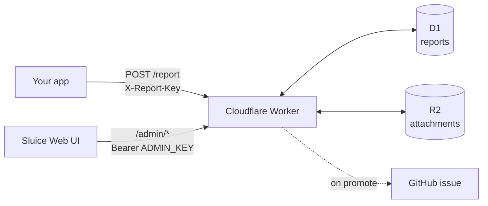

# Sluice

<p align="center">
  
</p>

> _A sluice is an artificial channel or trough used to control, direct, or carry off water._
> _It is typically fitted with a gate to regulate the flow._

A Cloudflare Workers-backed system that collects problem reports submitted by users of
your app and lets you, the app's maintainer, triage them into GitHub issues.

**[Live demo →](https://kushalpandya.github.io/Sluice)**

## What does it solve?

If you're running an app or a service with hundreds or thousands of users, some of them
will run into bugs, or have feature requests they'd like to share with you, along with
supporting details (e.g. log files, screenshots). Larger SaaS providers have plenty of
options for handling this, but for indie app developers there are almost none. Most indie
projects are run by one or two people at most, so the human capacity (or financial
resources) to triage incoming feedback is scarce or non-existent.

Sluice solves this exact problem by taking the friction out of reporting a bug or
suggesting a feature to you, the developer. It was created for
[Petrichor](https://petrichor.page/), a popular indie Mac app.

### User journey

Here's what a typical user journey looks like once you've integrated Sluice into your app:

1. A user is using your app and notices something wrong or missing.
2. They report it through your app's own UI, e.g. a form with a few fields for report details.
   Sluice provides a REST endpoint via a Cloudflare Worker; you control how the user submits
   the report to that endpoint.
3. On submission, your app makes a REST API call to the Worker's URL.
4. The Worker receives the report details in the request payload and stores them - report
   metadata in Cloudflare's D1 database, attachments (log files, screenshots, recordings,
   etc.) in R2 object storage.
5. You review the reports in the Sluice web frontend (a static site that accesses your data
   via the admin key) and triage them - promoting to a GitHub issue, discarding as spam, etc.

## Approach

Reports are stored, not auto-filed. When your app POSTs a report, the Worker
saves it to D1 (and any attachments to R2) and stops. You review reports in the
web UI and promote the real ones to issues yourself, so your repo never fills up
with spam.



Your reports stay in your Cloudflare account: D1 stores the report details and
R2 stores uploaded files. The web UI reads both through the Worker.

Sluice works with native apps, Electron apps, server-side code, and command-line
tools. A browser app on a different domain cannot submit directly to `/report`
without adding CORS support to that route or sending the report through its own
server.

## Set up Sluice

You need Node.js, npm, and a Cloudflare account. GitHub is only required if you
want to turn reports into issues.

1. Copy the example files. The copies are ignored by Git.

   ```bash
   cp worker/wrangler.jsonc.example worker/wrangler.jsonc
   cp worker/.env.example worker/.env
   cp web/src/config.example.js web/src/config.js
   ```

2. Install the dependencies and sign in to Cloudflare.

   ```bash
   npm install
   cd worker
   npx wrangler login
   ```

3. Create an R2 bucket for attachments and a D1 database for reports.

   ```bash
   npx wrangler r2 bucket create sluice-reports
   npx wrangler d1 create sluice-reports
   ```

4. In `worker/wrangler.jsonc`, paste the returned `database_id`. Set
   `PRODUCT_NAME`, `GITHUB_OWNER`, `GITHUB_REPO`, and `ADMIN_ALLOWED_ORIGIN`.
   Include `http://127.0.0.1:8123` in the allowed origins for local development.
   You can leave the report and rate limits at their defaults.

5. Create the database tables.

   ```bash
   npx wrangler d1 execute sluice-reports --remote --file schema.sql
   ```

6. Add the keys used by the deployed Worker.

   ```bash
   npx wrangler secret put APP_KEY
   npx wrangler secret put ADMIN_KEY
   # Optional: npx wrangler secret put GITHUB_TOKEN
   ```

   Use different strong random values for `APP_KEY` and `ADMIN_KEY`. The optional
   GitHub token must be a fine-grained token with issue read/write access to the
   configured repository.

7. Set `PRODUCT_NAME` in `web/src/config.js`. `DEFAULT_BASE` controls the Worker
   URL placeholder, and `--color-brand` in `web/src/styles.css` controls the
   accent colour.

## Run it locally

Add your local keys to `worker/.env`, then create the local database tables:

```bash
cd worker
npx wrangler d1 execute sluice-reports --local --file schema.sql
cd ..
```

Run these commands in separate terminals from the repository root:

```bash
npm run dev:api
npm run dev
```

Open `http://127.0.0.1:8123`, then connect to `http://127.0.0.1:8787` with the
`ADMIN_KEY` from `worker/.env`.

## Connect your app

Send reports to `POST /report` as `multipart/form-data`, with the app key in the
`X-Report-Key` header.

| Field | Required | What to send |
| --- | --- | --- |
| `reportId` | no | A UUID. Reusing it prevents duplicate reports; the Worker creates one if omitted. |
| `installationId` | yes | An anonymous ID for this installation, used for rate limits |
| `category` | yes | `bug`, `crash`, `feature`, or `other` |
| `summary` | yes | A short title, up to 200 characters |
| `description` | yes | The full report, up to 5,000 characters |
| `email` | yes | The reporter's email address, up to 254 characters |
| `appVersion` | yes | Your app's version, up to 100 characters |
| `osVersion` | yes | The operating system or platform, up to 100 characters |
| `metadata` | no | Extra information stored as text; JSON is accepted but not validated |
| `attachment` | no | A file such as a log, screenshot, or recording. Repeat this field to send more than one file. |

By default, a report can have up to 10 attachments, each no larger than 10 MiB.
Requests that declare a total size above 25 MiB are rejected. These values can
be changed in `worker/wrangler.jsonc`.

```bash
curl -X POST https://api.example.com/report \
  -H "X-Report-Key: $APP_KEY" \
  -F "reportId=$(uuidgen)" \
  -F "installationId=anon-123" \
  -F "category=bug" \
  -F "summary=Crash on export" \
  -F "description=Steps to reproduce..." \
  -F "email=user@example.com" \
  -F "appVersion=2.1.0" \
  -F "osVersion=macOS 14.5" \
  -F "attachment=@app.log.gz;type=application/gzip" \
  -F "attachment=@shot.png;type=image/png"
```

A successful request returns the report ID and whether it was already stored.
Rate limits run before duplicate detection, so a rapid retry may still be
rate-limited.

## Review reports

You can search reports, view attachments, mark reports as archived or spam,
delete them, or promote them to GitHub issues. Promotion is manual and lets you
edit the issue first. Its suggested labels must already exist in your repository.
Reporter email, installation ID, metadata, and attachments are left out of the
default issue. Each section shows at most 200 reports; there is no pagination.

## Deploy

From the repository root:

```bash
npm run deploy:api
npm run deploy:web
```

The web command expects a Cloudflare Pages project named `sluice-ui` with a
production branch named `production`. Change the script in `package.json` if
yours differs.

For custom domains, add one to the Worker and one to the Pages site. Update
`ADMIN_ALLOWED_ORIGIN` when the UI domain changes. Protect the UI with
Cloudflare Access, but leave `/report` reachable by your app.

## Keep it secure

`APP_KEY` discourages unwanted submissions, but a key embedded in an app can be
recovered. Rate limits and daily caps limit abuse. `ADMIN_KEY` can read and
delete reports and create GitHub issues, so treat it like a password.

The UI stores the admin key in browser `localStorage`. Use a trusted UI domain,
avoid third-party scripts there, restrict `ADMIN_ALLOWED_ORIGIN`, and enable
Cloudflare Access.

To replace the admin key, run the following commands from `worker/`:

```bash
openssl rand -base64 32
npx wrangler secret put ADMIN_KEY
```

The Worker uses the new key immediately. Sign in again and update `worker/.env`.
You can rotate `APP_KEY` the same way, but must also update your app.

## Delete reports and attachments

Deleting a report also deletes its attachments. Bulk delete removes reports
created within the selected period, regardless of status, and cannot be undone.

Do not expire R2 files by themselves: their D1 entries would remain and the UI
would show broken attachments.

**Only run the helper scripts against a disposable instance.** `worker/seed.sh`
deletes every report before adding samples. `worker/testreport.sh` also deletes
every report during cleanup; with `--promote`, it creates a real GitHub issue.

## Useful commands

| Command | What it does |
| --- | --- |
| `npm run dev` | Run the UI at `http://127.0.0.1:8123` |
| `npm run dev:api` | Run the Worker at `http://127.0.0.1:8787` |
| `npm run demo` | Run the UI with temporary sample data and no Worker |
| `npm run build` | Build the UI into `dist/` |
| `npm run deploy:api` | Deploy the Worker |
| `npm run deploy:web` | Build and deploy the UI to Cloudflare Pages |
| `npm run tail` | Stream logs from the deployed Worker |
| `npm run typecheck` | Check the Worker TypeScript |

## Project structure

The Worker API is in `worker/`, the Preact UI is in `web/`, and built UI files
go to `dist/`. Both use the root `package.json`.

## License

MIT - see [LICENSE](LICENSE).

## Author

[Kushal Pandya](https://doublslash.com/about)

Co-created with [Claude](https://claude.ai/)
